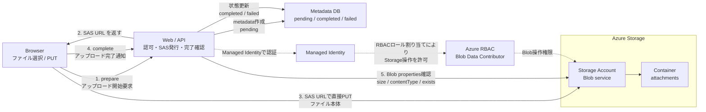

# Azurite Blob Upload Demo Materials

AzuriteでAzure Blob Storageの直接アップロードを試すためのデモ資料です。

## LTを見た方向け: 5分で試す

Docker Desktop を起動してから実行してください。

```bash
git clone https://github.com/horinat/azurite-blob-upload-demo.git
cd azurite-blob-upload-demo/demo
docker compose up azurite azurite-init
```

別ターミナルで:

```bash
cd azurite-blob-upload-demo/demo
./demo.sh success
```

これで、SAS URL 発行、Azurite への直接 PUT、Blob properties 確認、`completed` への状態更新まで一通り体験できます。

失敗ケースも試す場合:

```bash
./demo.sh fail
```

Windows PowerShell で実行する場合は [demo/WINDOWS_POWERSHELL.md](demo/WINDOWS_POWERSHELL.md) を参照してください。

## Files

- `demo/`
  - Azurite とデモ用 local API を Docker Compose で起動し、SAS URL 発行、直接 PUT、完了確認、失敗ケースを手元で試せるデモ一式です。
- `outputs/azurite-blob-upload-lt-native.pptx`
  - 発表・デモ用のPowerPoint資料です。
- `outputs/azurite-architecture.png`
  - サービス構成図の画像です。
- `outputs/azurite-architecture.svg`
  - サービス構成図のSVGです。
- `outputs/azurite-architecture.mmd`
  - サービス構成図のMermaidソースです。

## Architecture



## Key Point

ファイル本体はWeb/APIを通らず、BrowserがSAS URLを使ってBlob Storageへ直接PUTします。
Web/APIは、アップロード可否の判断、SAS URL発行、完了通知の受付、Blob properties確認、Metadata DBの状態更新を担当します。

## Try the Demo

このデモは Docker Desktop を使います。

```bash
cd demo
docker compose up azurite azurite-init
```

別ターミナルで:

```bash
cd demo
curl http://localhost:3000/health
```

詳しい手順は [demo/README.md](demo/README.md) を参照してください。

Windows PowerShell で実行する場合は [demo/WINDOWS_POWERSHELL.md](demo/WINDOWS_POWERSHELL.md) を参照してください。
