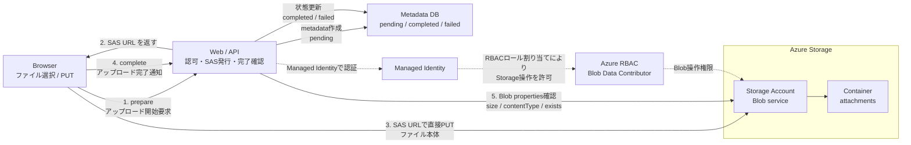
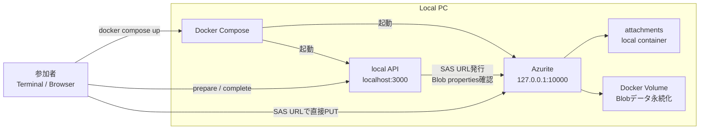

# Azurite Blob Upload Demo Materials

AzuriteでAzure Blob Storageの直接アップロードを試すためのデモ資料です。

## LTを見た方向け: 5分で試す

Docker Desktop を起動してから実行してください。

```bash
git clone https://github.com/horinat/azurite-blob-upload-demo.git
cd azurite-blob-upload-demo/demo
docker compose up azurite azurite-init
```

別ターミナルで:

```bash
cd azurite-blob-upload-demo/demo
./demo.sh success
```

これで、SAS URL 発行、Azurite への直接 PUT、Blob properties 確認、`completed` への状態更新まで一通り体験できます。

失敗ケースも試す場合:

```bash
./demo.sh fail
```

OS別の詳しい手順:

- macOS: [demo/MACOS.md](demo/MACOS.md)
- Windows PowerShell: [demo/WINDOWS_POWERSHELL.md](demo/WINDOWS_POWERSHELL.md)

## Files

- `demo/`
  - Azurite とデモ用 local API を Docker Compose で起動し、SAS URL 発行、直接 PUT、完了確認、失敗ケースを手元で試せるデモ一式です。
    
## Architecture: 本番構成の考え方



## Architecture: デモ環境

このリポジトリのデモでは、本物の Azure リソースは使いません。
Docker Compose で Azurite とデモ用 local API を起動し、手元のPCだけで直接アップロードの流れを試します。



デモ環境で起動するもの:

- `azurite`
  - Azure Blob Storage のローカルエミュレーター
  - Blob endpoint は `http://127.0.0.1:10000`
- `azurite-init`
  - デモ用 local API
  - API endpoint は `http://localhost:3000`
  - `attachments` コンテナ作成、CORS設定、SAS URL発行、Blob properties確認を行います

## Key Point

ファイル本体はWeb/APIを通らず、BrowserがSAS URLを使ってBlob Storageへ直接PUTします。
Web/APIは、アップロード可否の判断、SAS URL発行、完了通知の受付、Blob properties確認、Metadata DBの状態更新を担当します。

## Demo Prerequisites

事前に必要なもの:

- [Docker Desktop](https://www.docker.com/products/docker-desktop/)
- [Git](https://git-scm.com/install/)
  - Windows では WinGet でも導入できます: `winget install --id Git.Git -e --source winget`
  - インストール後はターミナルを開き直し、`git --version` で確認してください
- macOS / Linux / WSL の場合: curl と Node.js
- Windows PowerShell の場合: PowerShell
  - Git for Windows、Windows PowerShell、Docker Desktop の構成で実行できます
  - Ubuntu などの作業用 WSL ディストリビューションや、ローカルの Node.js は不要です

確認:

```powershell
git --version
docker compose version
```

Azureアカウント、Azure CLI、Azure Storage Account は不要です。
デモでは Azurite が Blob Storage の代わりにローカルで動きます。

初回起動時にダウンロードされるもの:

- Azurite の Docker image: `mcr.microsoft.com/azure-storage/azurite:latest`
- local API 用の Docker base image: `node:22-alpine`
- local API の npm packages: `express`, `@azure/storage-blob`

使うポート:

- `10000`: Azurite Blob endpoint
- `3000`: デモ用 local API

## Try the Demo

このデモは Docker Desktop を使います。

```bash
cd demo
docker compose up azurite azurite-init
```

別ターミナルで:

```bash
cd demo
curl http://localhost:3000/health
```

詳しい手順は [demo/README.md](demo/README.md) を参照してください。

- macOS: [demo/MACOS.md](demo/MACOS.md)
- Windows PowerShell: [demo/WINDOWS_POWERSHELL.md](demo/WINDOWS_POWERSHELL.md)
