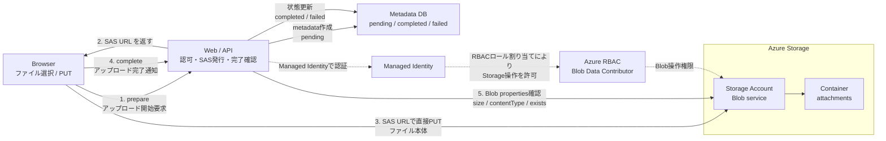

# Azurite Blob Upload Demo Materials

AzuriteでAzure Blob Storageの直接アップロードを試すためのデモ資料です。

## Files

- `outputs/azurite-blob-upload-lt-native.pptx`
  - 発表・デモ用のPowerPoint資料です。
- `outputs/azurite-architecture.png`
  - サービス構成図の画像です。
- `outputs/azurite-architecture.svg`
  - サービス構成図のSVGです。
- `outputs/azurite-architecture.mmd`
  - サービス構成図のMermaidソースです。

## Architecture

## Key Point

ファイル本体はWeb/APIを通らず、BrowserがSAS URLを使ってBlob Storageへ直接PUTします。
Web/APIは、アップロード可否の判断、SAS URL発行、完了通知の受付、Blob properties確認、Metadata DBの状態更新を担当します。

