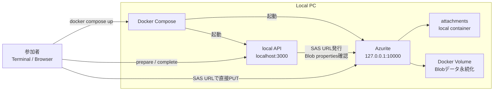

# Azurite Blob Upload Demo

Azure Blob Storageへの直接アップロード構成を、Azuriteでローカル検証するためのデモです。

このデモでは、次の流れを確認できます。

1. local APIがSAS URLを発行する
2. クライアントがSAS URLを使ってBlobへ直接PUTする
3. local APIがBlob propertiesを確認する
4. 正常なアップロードを`completed`にする
5. 申告サイズと実サイズが違うアップロードを`failed`にする

## このディレクトリの構成

```text
demo/
├── api/                 # デモ用local API
├── compose.yaml         # Azuriteとlocal APIの構成
├── demo.sh              # macOS / Linux / WSL向け補助スクリプト
└── README.md            # 全OS共通の実行手順
```

ドキュメントはこのREADMEに集約しています。
OSごとに別の説明書を探す必要はありません。文明は少しだけ前進しました。

## 必要なもの

Azureアカウント、Azure CLI、Azure Storage Accountは不要です。

### 共通

- [Docker Desktop](https://www.docker.com/products/docker-desktop/)
- [Git](https://git-scm.com/install/)

### macOS / Linux / WSL

- bash
- curl
- Node.js

Node.jsは、APIレスポンスのJSONから`uploadUrl`と`attachmentId`を取り出すために使います。

macOSでHomebrewを利用している場合:

```bash
brew install git node
```

Docker Desktopのインストーラーを選ぶ際にMacのチップを確認したい場合:

```bash
uname -m
```

- `arm64`: Apple Silicon
- `x86_64`: Intel

### Windows PowerShell

- Windows PowerShell
- Git for Windows
- Docker Desktop

Git for WindowsはWinGetでも導入できます。

```powershell
winget install --id Git.Git -e --source winget
```

Windows PowerShellの手順では、作業用のUbuntuやローカルのNode.jsは不要です。

## インストール確認

macOS / Linux / WSL:

```bash
git --version
curl --version
node --version
docker compose version
```

Windows PowerShell:

```powershell
git --version
docker compose version
```

Dockerコマンドがデーモンへ接続できない場合は、Docker Desktopを起動してください。

macOS:

```bash
open -a Docker
```

## リポジトリを取得

任意の作業用ディレクトリで実行します。

macOS / Linux / WSL:

```bash
cd ~
mkdir -p 20260728-dx-dojo
cd 20260728-dx-dojo

git clone https://github.com/horinat/azurite-blob-upload-demo.git
cd azurite-blob-upload-demo/demo
```

Windows PowerShell:

```powershell
cd $HOME
mkdir 20260728-dx-dojo -Force
cd 20260728-dx-dojo

git clone https://github.com/horinat/azurite-blob-upload-demo.git
cd azurite-blob-upload-demo\demo
```

すでにclone済みの場合は、再度cloneせず既存のリポジトリを更新します。

macOS / Linux / WSL:

```bash
cd ~/20260728-dx-dojo/azurite-blob-upload-demo
git pull
cd demo
```

Windows PowerShell:

```powershell
cd $HOME\20260728-dx-dojo\azurite-blob-upload-demo
git pull
cd demo
```

現在地の末尾が`azurite-blob-upload-demo/demo`になっていることを確認してください。

macOS / Linux / WSL:

```bash
pwd
```

Windows PowerShell:

```powershell
Get-Location
```

## まず試す

### macOS / Linux / WSL

`demo.sh`を使うと、最短で一連の流れを確認できます。

```bash
./demo.sh start
./demo.sh success
./demo.sh fail
```

- `start`: Azuriteとlocal APIをバックグラウンドで起動
- `success`: 正常系を一括実行
- `fail`: サイズ不一致の失敗系を一括実行

`permission denied: ./demo.sh`と表示された場合:

```bash
chmod +x demo.sh
```

### Windows PowerShell

ターミナル1で起動します。

```powershell
docker compose up azurite azurite-init
```

ログに次が表示されたら準備完了です。

```text
Local API listening on http://localhost:3000
```

ターミナル1は開いたままにし、別のPowerShellで以降の手順を実行します。

## デモ環境



起動するサービス:

- `azurite`
  - Azure Blob Storageのローカルエミュレーター
  - Blob endpoint: `http://127.0.0.1:10000`
- `azurite-init`
  - デモ用local API
  - API endpoint: `http://localhost:3000`
  - `attachments`コンテナ作成、CORS設定、SAS URL発行、Blob properties確認を担当

使用するポート:

- `10000`: Azurite Blob endpoint
- `3000`: local API

初回起動時はAzurite image、Node.js base image、npm packagesを取得するため、インターネット接続が必要です。

## 1. Azuriteとlocal APIを起動

ターミナル1で実行します。

```bash
docker compose up azurite azurite-init
```

このコマンドはmacOS、Linux、WSL、Windows PowerShellで共通です。
ターミナル1は起動ログ表示用なので開いたままにします。

別のターミナルで疎通確認します。

macOS / Linux / WSL:

```bash
curl -sS http://localhost:3000/health
```

期待する結果:

```json
{"ok":true}
```

Windows PowerShell:

```powershell
Invoke-RestMethod -Uri "http://localhost:3000/health"
```

期待する結果:

```text
ok
--
True
```

## 2. SAS URLを発行

### macOS / Linux / WSL

```bash
RESP=$(curl -sS -X POST http://localhost:3000/api/attachments/prepare \
  -H "Content-Type: application/json" \
  -d '{
    "fileName": "hello.txt",
    "fileSize": 12,
    "contentType": "text/plain"
  }')

echo "$RESP"
```

次の手順で使う値を変数へ入れます。

```bash
UPLOAD_URL=$(node -e 'console.log(JSON.parse(process.argv[1]).uploadUrl)' "$RESP")
ATTACHMENT_ID=$(node -e 'console.log(JSON.parse(process.argv[1]).attachmentId)' "$RESP")

echo "$UPLOAD_URL"
echo "$ATTACHMENT_ID"
```

### Windows PowerShell

```powershell
$resp = Invoke-RestMethod `
  -Method Post `
  -Uri "http://localhost:3000/api/attachments/prepare" `
  -ContentType "application/json" `
  -Body '{
    "fileName": "hello.txt",
    "fileSize": 12,
    "contentType": "text/plain"
  }'

$uploadUrl = $resp.uploadUrl
$attachmentId = $resp.attachmentId

$resp
$uploadUrl
$attachmentId
```

発行されたアップロードURLは`http://127.0.0.1:10000/...`から始まります。
PUT先は`localhost:3000`のAPIではなく、AzuriteのBlob endpointです。

## 3. Blobへ直接PUT

### macOS / Linux / WSL

12バイトのファイルを作成して確認します。

```bash
printf "hello azure\n" > /tmp/hello.txt
wc -c < /tmp/hello.txt
```

`12`と表示されることを確認してアップロードします。

```bash
curl -i -X PUT "$UPLOAD_URL" \
  -H "x-ms-blob-type: BlockBlob" \
  -H "Content-Type: text/plain" \
  --data-binary @/tmp/hello.txt
```

期待する結果:

```text
HTTP/1.1 201 Created
```

### Windows PowerShell

PowerShellの文字コードや改行差異を避けるため、UTF-8 BOMなしで書き込みます。

```powershell
[System.IO.File]::WriteAllText(
  "$env:TEMP\hello.txt",
  "hello azure`n",
  [System.Text.UTF8Encoding]::new($false)
)

(Get-Item "$env:TEMP\hello.txt").Length
```

`12`と表示されることを確認してアップロードします。

```powershell
Invoke-WebRequest `
  -UseBasicParsing `
  -Method Put `
  -Uri $uploadUrl `
  -Headers @{
    "x-ms-blob-type" = "BlockBlob"
    "Content-Type" = "text/plain"
  } `
  -InFile "$env:TEMP\hello.txt"
```

期待する結果:

```text
StatusCode        : 201
StatusDescription : Created
```

`-UseBasicParsing`は、Windows PowerShellがレスポンスをWebページとして解析する際のセキュリティ警告を避けるために指定しています。

## 4. 完了確認

local APIがBlob propertiesを取得し、申告したファイルサイズとContent-Typeに一致することを確認します。

### macOS / Linux / WSL

```bash
curl -sS -X POST \
  "http://localhost:3000/api/attachments/$ATTACHMENT_ID/complete"
```

期待する結果:

```json
{"status":"completed","fileSize":12,"contentType":"text/plain"}
```

### Windows PowerShell

```powershell
Invoke-RestMethod `
  -Method Post `
  -Uri "http://localhost:3000/api/attachments/$attachmentId/complete"
```

期待する結果:

```text
status    fileSize contentType
------    -------- -----------
completed       12 text/plain
```

## 5. サイズ不一致の失敗ケース

`fileSize: 999`と申告し、実際には6バイトのファイルをアップロードします。
BlobへのPUT自体は成功しますが、完了確認でHTTP 422になります。

### macOS / Linux / WSL

新しいSAS URLを発行します。

```bash
RESP=$(curl -sS -X POST http://localhost:3000/api/attachments/prepare \
  -H "Content-Type: application/json" \
  -d '{
    "fileName": "wrong-size.txt",
    "fileSize": 999,
    "contentType": "text/plain"
  }')

UPLOAD_URL=$(node -e 'console.log(JSON.parse(process.argv[1]).uploadUrl)' "$RESP")
ATTACHMENT_ID=$(node -e 'console.log(JSON.parse(process.argv[1]).attachmentId)' "$RESP")
```

6バイトのファイルを作成してPUTします。

```bash
printf "small\n" > /tmp/small.txt
wc -c < /tmp/small.txt

curl -i -X PUT "$UPLOAD_URL" \
  -H "x-ms-blob-type: BlockBlob" \
  -H "Content-Type: text/plain" \
  --data-binary @/tmp/small.txt
```

完了確認:

```bash
curl -i -X POST \
  "http://localhost:3000/api/attachments/$ATTACHMENT_ID/complete"
```

期待する結果:

```text
HTTP/1.1 422 Unprocessable Entity
```

```json
{"status":"failed","reason":"file size mismatch","expectedSize":999,"actualSize":6}
```

通常のcurlはHTTP 4xxでも本文を表示します。
`--fail`または`-f`を付けた場合は、HTTP 422をエラー終了として扱います。

### Windows PowerShell

新しいSAS URLを発行します。

```powershell
$resp = Invoke-RestMethod `
  -Method Post `
  -Uri "http://localhost:3000/api/attachments/prepare" `
  -ContentType "application/json" `
  -Body '{
    "fileName": "wrong-size.txt",
    "fileSize": 999,
    "contentType": "text/plain"
  }'

$uploadUrl = $resp.uploadUrl
$attachmentId = $resp.attachmentId
```

6バイトのファイルを作成してPUTします。

```powershell
[System.IO.File]::WriteAllText(
  "$env:TEMP\small.txt",
  "small`n",
  [System.Text.UTF8Encoding]::new($false)
)

(Get-Item "$env:TEMP\small.txt").Length

Invoke-WebRequest `
  -UseBasicParsing `
  -Method Put `
  -Uri $uploadUrl `
  -Headers @{
    "x-ms-blob-type" = "BlockBlob"
    "Content-Type" = "text/plain"
  } `
  -InFile "$env:TEMP\small.txt"
```

サイズ不一致時、APIはHTTP 422を返します。
Windows PowerShellの`Invoke-RestMethod`では例外として扱われるため、`try` / `catch`で本文を表示します。

```powershell
try {
  Invoke-RestMethod `
    -Method Post `
    -Uri "http://localhost:3000/api/attachments/$attachmentId/complete"
} catch {
  $_.ErrorDetails.Message | ConvertFrom-Json
}
```

期待する結果:

```text
status       : failed
reason       : file size mismatch
expectedSize : 999
actualSize   : 6
```

これは想定どおりの失敗です。
直接アップロード後にAPIがBlobの実体を確認できていることを示します。

## 発表・動作確認用の短縮コマンド

macOS / Linux / WSLでは、`demo.sh`を使って発表時の操作を短くできます。

```bash
./demo.sh start      # Azuriteとlocal APIを起動
./demo.sh health     # 疎通確認
./demo.sh prepare    # SAS URLを発行
./demo.sh put        # Blobへ直接PUT
./demo.sh complete   # completedを確認
./demo.sh success    # 正常系を一括実行
./demo.sh fail       # サイズ不一致を一括実行
./demo.sh stop       # コンテナを停止
./demo.sh reset      # コンテナとVolumeを削除
```

スライドに合わせて段階的に見せる場合:

```bash
./demo.sh start
./demo.sh prepare
./demo.sh put
./demo.sh complete
./demo.sh fail
```

## 片付け

Blobデータを残してコンテナだけ停止:

```bash
docker compose stop
```

コンテナ、ネットワーク、Blobデータ用Volumeを削除して初期化:

```bash
docker compose down -v
```

macOS / Linux / WSLで`demo.sh`を使う場合:

```bash
./demo.sh stop
./demo.sh reset
```

## よくある問題

### `Cannot connect to the Docker daemon`

Docker Desktopを起動し、`docker compose version`を再実行してください。

### `command not found: node`

macOS / Linux / WSL側にNode.jsが必要です。

macOSでHomebrewを使う場合:

```bash
brew install node
node --version
```

### `permission denied: ./demo.sh`

```bash
chmod +x demo.sh
```

### ポート3000または10000が使用中

macOS / Linux:

```bash
lsof -nP -iTCP:3000 -sTCP:LISTEN
lsof -nP -iTCP:10000 -sTCP:LISTEN
```

Windows PowerShell:

```powershell
Get-NetTCPConnection -LocalPort 3000,10000 -ErrorAction SilentlyContinue
```

別のデモ用コンテナが残っている場合:

```bash
docker compose down
```

### `destination path 'azurite-blob-upload-demo' already exists`

リポジトリはすでにcloneされています。既存ディレクトリへ移動し、`git pull`してください。

## 注意

SAS URLには`sig=...`という署名が含まれます。
本番のSAS URLは秘密情報として扱い、ログ、スクリーンショット、公開資料、SNSへそのまま掲載しないでください。
