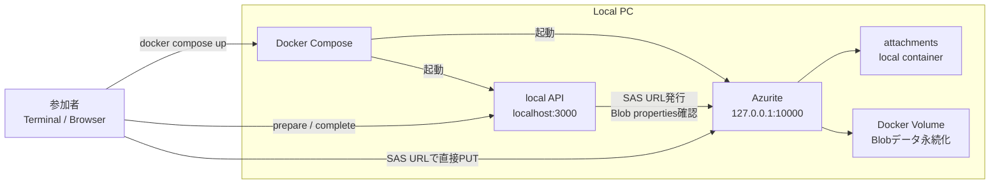

# Azurite Blob Upload Demo

Azure Blob Storage への直接アップロード構成を、Azurite でローカル検証するためのデモです。

このデモでは、次の流れを手元で試せます。

- SAS URL を発行する
- SAS URL を使って Blob へ直接 PUT する
- Blob properties を確認して `completed` にする
- 申告サイズと実サイズが違う失敗ケースを `failed` にする

## まず試す

Docker Desktop を起動してから、ターミナル1で実行します。

```bash
docker compose up azurite azurite-init
```

別ターミナルで、成功ケースを一括実行します。

```bash
./demo.sh success
```

失敗ケースも試す場合:

```bash
./demo.sh fail
```

1つずつコマンドを打って LT と同じ流れを確認したい場合は、下の `Demo 1` 以降を順番に実行してください。

## 必要なもの

- Docker Desktop
  - Azurite と local API を Docker Compose で起動するために使います
- Git
  - このリポジトリを取得するために使います
- macOS / Linux / WSL の場合
  - curl
  - Node.js
    - 手動コマンドや `demo.sh` で、レスポンス JSON から `uploadUrl` と `attachmentId` を取り出すために使います
- Windows PowerShell の場合
  - Windows PowerShell
  - Windows PowerShell の手順だけを使う場合、ローカルの Node.js は不要です

Azureアカウント、Azure CLI、Azure Storage Account は不要です。
このデモでは Azurite が Blob Storage の代わりとしてローカルで動きます。

## 初回起動時にダウンロードされるもの

初回の `docker compose up azurite azurite-init` では、必要な Docker image や npm packages を取得するため、少し時間がかかります。

- Azurite の Docker image
  - `mcr.microsoft.com/azure-storage/azurite:latest`
- local API 用の Docker base image
  - `node:22-alpine`
- local API の npm packages
  - `express`
  - `@azure/storage-blob`

初回起動時はインターネット接続が必要です。
2回目以降は、取得済みの image や package cache が使われるため、初回より速く起動できます。

## デモ環境の構成



このデモで動くもの:

- `azurite`
  - Azure Blob Storage のローカルエミュレーターです
  - Blob endpoint は `http://127.0.0.1:10000` です
- `azurite-init`
  - デモ用 local API です
  - API endpoint は `http://localhost:3000` です
  - `attachments` コンテナ作成、CORS設定、SAS URL発行、Blob properties確認を行います

使うポート:

- `10000`: Azurite Blob endpoint
- `3000`: デモ用 local API

## デモ環境構築

### 1. リポジトリを取得

```bash
git clone https://github.com/horinat/azurite-blob-upload-demo.git
cd azurite-blob-upload-demo
```

### 2. Docker Desktop を起動

このデモは Azurite と local API を Docker Compose で起動します。
事前に Docker Desktop を起動して、`docker compose` が使える状態にしてください。

確認:

```bash
docker compose version
```

### 3. デモ用ディレクトリへ移動

macOS / Linux / WSL:

```bash
cd demo
```

Windows PowerShell:

```powershell
cd demo
```

### 4. 初回起動

```bash
docker compose up azurite azurite-init
```

初回は Docker image の取得と local API の依存パッケージインストールがあるため、少し時間がかかります。
ログに `Local API listening on http://localhost:3000` が出たら準備完了です。

### 5. 疎通確認

別ターミナルを開き、同じ `demo` ディレクトリで実行します。

macOS / Linux / WSL:

```bash
curl http://localhost:3000/health
```

Windows PowerShell:

```powershell
Invoke-RestMethod -Uri "http://localhost:3000/health"
```

`{"ok":true}` または `ok: True` が返れば、デモ環境は起動できています。

## OS別のコマンド

このREADMEのコマンドは macOS / Linux / WSL の bash 向けです。

Windows PowerShell で実行したい場合は、[WINDOWS_POWERSHELL.md](WINDOWS_POWERSHELL.md) を参照してください。

## Demo 1: Azurite を起動

ターミナル1で実行します。

```bash
cd demo
docker compose up azurite azurite-init
```

このターミナルは起動ログ表示用なので、開いたままにします。

別ターミナルで疎通確認します。

```bash
curl http://localhost:3000/health
```

期待する結果:

```json
{"ok":true}
```

## Demo 2: SAS URL を発行

ターミナル2で実行します。

```bash
cd demo
```

```bash
RESP=$(curl -s -X POST http://localhost:3000/api/attachments/prepare \
  -H "Content-Type: application/json" \
  -d '{
    "fileName": "hello.txt",
    "fileSize": 12,
    "contentType": "text/plain"
  }')
```

```bash
echo "$RESP"
```

次のデモで使う値を取り出します。

```bash
UPLOAD_URL=$(node -e 'console.log(JSON.parse(process.argv[1]).uploadUrl)' "$RESP")
ATTACHMENT_ID=$(node -e 'console.log(JSON.parse(process.argv[1]).attachmentId)' "$RESP")
```

確認:

```bash
echo "$UPLOAD_URL"
echo "$ATTACHMENT_ID"
```

## Demo 3: Blob へ直接 PUT

```bash
printf "hello azure\n" > /tmp/hello.txt
```

```bash
curl -X PUT "$UPLOAD_URL" \
  -H "x-ms-blob-type: BlockBlob" \
  -H "Content-Type: text/plain" \
  --data-binary @/tmp/hello.txt
```

`UPLOAD_URL` は `http://127.0.0.1:10000/...` から始まります。つまり、PUT 先は `localhost:3000` の API ではなく、Azurite の Blob エンドポイントです。

## Demo 4: 完了確認

```bash
curl -X POST "http://localhost:3000/api/attachments/$ATTACHMENT_ID/complete"
```

期待する結果:

```json
{"status":"completed","fileSize":12,"contentType":"text/plain"}
```

## Demo 5: 失敗ケース

わざと `fileSize: 999` と申告して、実際には小さいファイルをアップロードします。

```bash
RESP=$(curl -s -X POST http://localhost:3000/api/attachments/prepare \
  -H "Content-Type: application/json" \
  -d '{
    "fileName": "wrong-size.txt",
    "fileSize": 999,
    "contentType": "text/plain"
  }')
```

```bash
echo "$RESP"
```

```bash
UPLOAD_URL=$(node -e 'console.log(JSON.parse(process.argv[1]).uploadUrl)' "$RESP")
ATTACHMENT_ID=$(node -e 'console.log(JSON.parse(process.argv[1]).attachmentId)' "$RESP")
```

```bash
printf "small\n" > /tmp/small.txt
```

```bash
curl -X PUT "$UPLOAD_URL" \
  -H "x-ms-blob-type: BlockBlob" \
  -H "Content-Type: text/plain" \
  --data-binary @/tmp/small.txt
```

```bash
curl -X POST "http://localhost:3000/api/attachments/$ATTACHMENT_ID/complete"
```

期待する結果:

```json
{"status":"failed","reason":"file size mismatch","expectedSize":999,"actualSize":6}
```

## 一括実行したい場合

スライドでは1つずつコマンドを打つ想定ですが、動作確認用にまとめたスクリプトもあります。

```bash
./demo.sh start
./demo.sh success
./demo.sh fail
```

## 片付け

コンテナを停止:

```bash
docker compose stop
```

データも含めて初期化:

```bash
docker compose down -v
```

## 注意

SAS URL には `sig=...` という署名が含まれます。本番の SAS URL は秘密情報として扱い、ログや公開資料にそのまま出さないでください。
